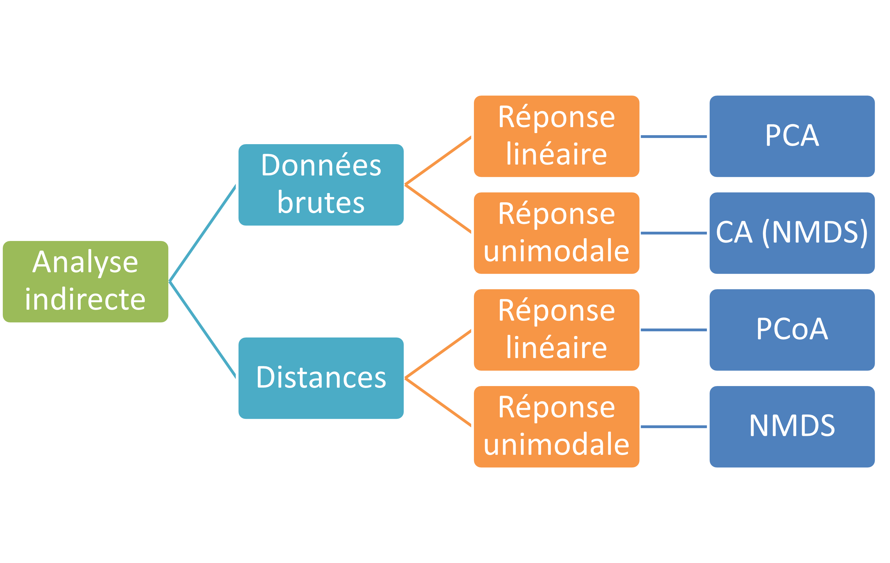
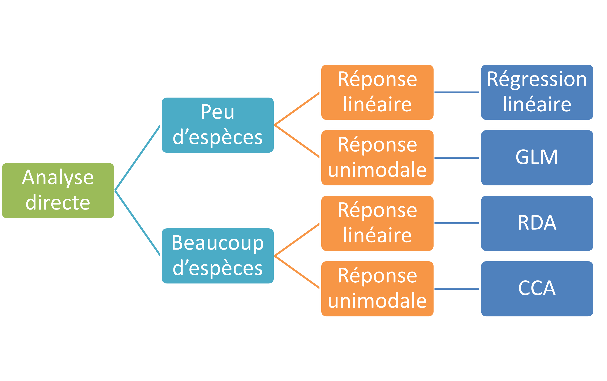

```{r}
#| label: DoNotModify
#| include: false
### Utilities. Do not modify.
# Installation of packages if necessary
InstallPackages <- function(Packages) {
  InstallPackage <- function(Package) {
    if (!Package %in% installed.packages()[, 1]) {
      install.packages(Package, repos = "https://cran.rstudio.com/")
    }
  }
  invisible(sapply(Packages, InstallPackage))
}

# Basic packages
InstallPackages(c("bookdown", "formatR", "kableExtra", "ragg"))

# kableExtra must be loaded 
if (knitr::opts_knit$get("rmarkdown.pandoc.to") == "docx") {
  # Word output (https://stackoverflow.com/questions/35144130/in-knitr-how-can-i-test-for-if-the-output-will-be-pdf-or-word)
  # Do not use autoformat (https://github.com/haozhu233/kableExtra/issues/308)
  options(kableExtra.auto_format = FALSE)
}
library("kableExtra")

# Chunk font size hook: allows size='small' or any valid Latex font size in chunk options
def.chunk.hook  <- knitr::knit_hooks$get("chunk")
knitr::knit_hooks$set(chunk = function(x, options) {
  x <- def.chunk.hook(x, options)
  ifelse(options$size != "normalsize", paste0("\n \\", options$size,"\n\n", x, "\n\n \\normalsize"), x)
})
```

```{r}
#| label: Options
#| include: false
### Customized options for this document
# Add necessary packages here
Packages <- c(
  "tidyverse", 
  "FactoMineR", 
  "factoextra",
  "scatterplot3d",
  "MASS"
)
# Install them
InstallPackages(Packages)

# knitr options
knitr::opts_chunk$set(
  cache =   TRUE,     # Cache chunk results
  include = TRUE,     # Show/Hide chunks
  echo =    TRUE,     # Show/Hide code
  warning = FALSE,    # Show/Hide warnings
  message = FALSE,    # Show/Hide messages
  # Figure alignment and size
  fig.align = 'center', out.width = '80%',
  # Graphic devices (ragg_png is better than standard png)
  dev = c("ragg_png", "pdf"),
  # Code chunk format
  tidy = FALSE, tidy.opts = list(blank = FALSE, width.cutoff = 50),
  size = "scriptsize", knitr.graphics.auto_pdf = TRUE
)
options(width = 50)

# ggplot style
library("tidyverse")
theme_set(theme_bw())
theme_update(
  panel.background = element_rect(fill = "transparent", colour = NA),
  plot.background = element_rect(fill = "transparent", colour = NA)
)
knitr::opts_chunk$set(dev.args = list(bg = "transparent"))

# Tibbles: 5 lines, fit to slide width
options(tibble.print_min = 5, tibble.width = 50)

# Random seed
set.seed(974)
```


# Généralités

## Objectifs

Comprendre les principes des méthodes d'ordination, aussi appelées analyses multivariées.

Connaître les principales méthodes et savoir les appliquer.


## Pour quoi faire ?

Discipline cible : écologie des communautés.

Problématique : analyse des effets de nombreux facteurs sur de nombreuses espèces, sans modèle (ou presque).

Méthode : réduction de dimensionnalité.


## Typologie des méthodes 

Statistiques multivariées :

- Classification (automatique).

- Ordination : arrangement d'espèces le long de gradients
  - Analyse directe.
  - Analyse indirecte.


## Forme des données

Tableaux de données :

- Lignes = échantillons (sites).
- Colonnes = présence / absence ou abondance d'espèces.

Pour les méthodes d'analyse directe, colonnes supplémentaires = facteurs environnementaux (quantitatifs ou qualitatifs).


## Particularités

Grand nombre de dimensions dans les données brutes, mais hypothèse que les relations importantes se résument à un nombre réduit (2 ou 3 dimensions dans l'idéal).

Données avec de nombreux zéros, très bruitées et redondantes : peu adaptées à des modèles classiques (du type présence de l'espèce $s$ ~ environnement).

Méthodes exploratoires seulement.


# Réponse linéaire, analyse indirecte


## Analyse en Composantes Principales

Pearson, K. (1901) On lines and planes of closest fit to systems of points in space. *Philosophical Magazine* 2:559-572.
Anglais : PCA, Français : ACP.

Objectif : représenter un tableau de données multidimensionnel par réduction du nombre de dimensions.

Modèle : Réponse linéaire de la présence des espèces aux gradients.


## ACP : Méthode

Rotation du nuage de points original (espèces dans l’espace des sites). Les données peuvent être centrées et réduites.

Le premier axe représente la variabilité maximale.

Les axes suivants sont orthogonaux et représentent le maximum de variabilité résiduelle.


## Exemple

Simulation de données corrélés en 3 dimensions

```{r}
library(MASS) # Attention à MASS::select()
# Matrice de covariance
Sigma <- matrix(
  c(
    1,   0.8, 0.6, 
    0.8, 1,   0.8,
    0.6, 0.8, 1
  ), 
  nrow = 3
)
# Simulation de X et Y
XYZ <- mvrnorm(10, mu = rep(0, 3), Sigma = Sigma)
```


## Points

```{r}
#| echo: false
# ACP
XYZ_pca <- prcomp(XYZ)
library("scatterplot3d")
# Création du graphique 3D
s3d <- scatterplot3d(
  # Position des points, 3 colonnes x, y et z
  XYZ,
  # Type de graphique : points
  type = "p", 
  # Cercles
  pch = 19,
  # Couleurs des points sous le plan, les autres seront retracés
  color = "darkgrey",
  # Afficher le repère à z =0
  grid = TRUE, 
  # Ne pas afficher de boîte autour du graphique
  box = TRUE,
  # Marges
  mar = c(1, 1, 1, 1),
  # Angle de vision (0 = horizontal)
  angle = 40
)
# Positon des points convertie en 2D
XYZ_conv <- s3d$xyz.convert(XYZ[, 1], XYZ[, 2], XYZ[, 3])
```


## Premier axe

```{r}
#| echo: false
# Création du graphique 3D
s3d <- scatterplot3d(
  # Position des points, 3 colonnes x, y et z
  XYZ,
  # Type de graphique : points
  type = "p", 
  # Cercles
  pch = 19,
  # Couleurs des points sous le plan, les autres seront retracés
  color = "darkgrey",
  # Afficher le repère à z =0
  grid = TRUE, 
  # Ne pas afficher de boîte autour du graphique
  box = TRUE,
  # Marges
  mar = c(1, 1, 1, 1),
  # Angle de vision (0 = horizontal)
  angle = 40
)
# Limite des axes (x fois le vecteur propre)
eigen_times <- c(-4, 4)
# Axe 1
s3d$points3d(
  x = eigen_times * XYZ_pca$rotation[1, 1],
  y = eigen_times * XYZ_pca$rotation[2, 1],
  z = eigen_times * XYZ_pca$rotation[3, 1],
  type = "l",
  col = "red"
)
# Projections
XYZ_x1 <- XYZ_pca$x[, 1] %*% t(XYZ_pca$rotation[, 1])
s3d$points3d(
  x = XYZ_x1[, 1], 
  y = XYZ_x1[, 2], 
  z = XYZ_x1[, 3], 
  col = "red"
)
# Segments du point à la droite
XYZ_x1_conv <- s3d$xyz.convert(XYZ_x1[, 1], XYZ_x1[, 2], XYZ_x1[, 3])
segments(
  x0 = XYZ_conv$x, y0 = XYZ_conv$y, 
  x1 = XYZ_x1_conv$x, y1 = XYZ_x1_conv$y, 
  col = "red",
  lty = 2
)
text(XYZ_conv, labels = 1:10)
```


## Deuxième axe

```{r}
#| echo: false
# Création du graphique 3D
s3d <- scatterplot3d(
  # Position des points, 3 colonnes x, y et z
  XYZ,
  # Type de graphique : points
  type = "p", 
  # Cercles
  pch = 19,
  # Couleurs des points sous le plan, les autres seront retracés
  color = "darkgrey",
  # Afficher le repère à z =0
  grid = TRUE, 
  # Ne pas afficher de boîte autour du graphique
  box = TRUE,
  # Marges
  mar = c(1, 1, 1, 1),
  # Angle de vision (0 = horizontal)
  angle = 40
)
# Axe 1
s3d$points3d(
  x = eigen_times * XYZ_pca$rotation[1, 1],
  y = eigen_times * XYZ_pca$rotation[2, 1],
  z = eigen_times * XYZ_pca$rotation[3, 1],
  type = "l",
  col = "red"
)
# Projections
XYZ_x1 <- XYZ_pca$x[, 1] %*% t(XYZ_pca$rotation[, 1])
s3d$points3d(
  x = XYZ_x1[, 1], 
  y = XYZ_x1[, 2], 
  z = XYZ_x1[, 3], 
  col = "red"
)
# Segments du point à la droite
XYZ_x1_conv <- s3d$xyz.convert(XYZ_x1[, 1], XYZ_x1[, 2], XYZ_x1[, 3])
segments(
  x0 = XYZ_conv$x, y0 = XYZ_conv$y, 
  x1 = XYZ_x1_conv$x, y1 = XYZ_x1_conv$y, 
  col = "red",
  lty = 2
)
# Axe 2
s3d$points3d(
  x = eigen_times * XYZ_pca$rotation[1, 2],
  y = eigen_times * XYZ_pca$rotation[2, 2],
  z = eigen_times * XYZ_pca$rotation[3, 2],
  type = "l",
  col = "green"
)
# Projections
XYZ_x2 <- XYZ_pca$x[, 2] %*% t(XYZ_pca$rotation[, 2])
s3d$points3d(
  x = XYZ_x2[, 1], 
  y = XYZ_x2[, 2], 
  z = XYZ_x2[, 3], 
  col = "green"
)
# Segments du point à la droite
XYZ_x2_conv <- s3d$xyz.convert(XYZ_x2[, 1], XYZ_x2[, 2], XYZ_x2[, 3])
# Tracé des segments
segments(
  x0 = XYZ_conv$x, y0 = XYZ_conv$y, 
  x1 = XYZ_x2_conv$x, y1 = XYZ_x2_conv$y, 
  col = "green",
  lty = 2
)
text(XYZ_conv, labels = 1:10)
```


## ACP : Pratique

`stats::prcomp()` ou `ade4::dudi.pca()` ou `FactoMineR::PCA()`.
Visualisation avec *factoextra*.

```{r}
#| out.width: 55%
# ACP
XYZ_pca <- prcomp(XYZ)
library("factoextra")
fviz_eig(XYZ_pca)
```

Affichage des valeurs propres.


## ACP : Pratique

```{r}
fviz_pca_ind(
  XYZ_pca,
  col.ind = "cos2", # Color by the quality of representation
  gradient.cols = c("#00AFBB", "#E7B800", "#FC4E07"),
  repel = TRUE     # Avoid text overlapping
)
```


## ACP : Pratique

```{r}
fviz_pca_var(
  XYZ_pca,
  col.var = "contrib", # Color by contributions to the PC
  gradient.cols = c("#00AFBB", "#E7B800", "#FC4E07"),
  repel = TRUE     # Avoid text overlapping
)
```


## ACP : Pratique

```{r}
fviz_pca_biplot(
  XYZ_pca, 
  repel = TRUE,
  col.var = "#2E9FDF", # Variables color
  col.ind = "#696969"  # Individuals color
)
```


## Analyse des Correspondances Multiples

Tenenhaus, M. & Young, F.W. (1985) An analysis and synthesis of multiple correspondence analysis, optimal scaling, dual scaling, homogeneity analysis ans other methods for quantifying categorical multivariate data. *Psychometrika*,  50:91-119.

Anglais : MCA, Français : ACM


## ACM : objectif

Identique à l’ACP mais les données sont toutes qualitatives (*factors* dans R) et les catégories ne sont pas ordonnées.

Chaque variable est éclatée en autant de variables que de modalités.

`ade4::dudi.acm()`.


## Analyse de Hill-Smith

Hill, M. O., and A. J. E. Smith. 1976. Principal component analysis of taxonomic data with multi-state discrete characters. *Taxon*, 25:249-255.

Objectif : traiter des données mixtes quantitatives et qualitatives ordonnées ou non.

`ade4::dudi.hillsmith()`.


## Analyse en Coordonnées Principales

Gower, J. C. (1966) Some distance properties of latent root and vector methods used in multivariate analysis. *Biometrika*, 53: 325–338.

Anglais : PCoA

Objectif : identique à l’ACP, mais on dispose d’une matrice de distances entre relevés, pas de coordonnées.


## PCoA : Méthode

Si la matrice de distance est euclidienne, les relevés sont représentés dans l’espace, une ACP suit pour les projections.

Pas de biplot : seules les distances entre relevés sont connues.

`ade4::dudi.pco()`.


# Réponse non linéaire, analyse indirecte


## Analyse Factorielle des Correspondances

Hirschfeld, H.O. (1935) "A connection between correlation and contingency", *Proc. Cambridge Philosophical Society*, 31: 520–524

Anglais : CA, Français : AFC.

Objectif : identique à l’ACP, mais la métrique est différente.

`ade4::dudi.coa()`.


## AFC : moyennes réciproques

On suppose que la réponse des espèces aux gradients est unimodale (et non linéaire).

*Reciprocal Averaging Algorithm* ; Intuition en 1D : 

- le score du site $j$ représente sa position sur le gradient environnemental. 
  L'optimum environnemental pour l’espèce $i$ est la moyenne des scores des sites pondérée par la fréquence de l'espèce.

- Raisonnement symétrique pour le score de l'espèce $j$ : sa position sur le gradient est la moyenne pondérée des scores des sites où elle est présente.


## AFC : moyennes réciproques

En réalité, la niche est en n-1 dimensions, les espèces sont au centre de gravité des sites et inversement.

Les sites proches ont les mêmes "caractéristiques environnementales".
Les espèces proches "occupent la même niche".

Une espèce est proche d'un site si les caractéristiques du site correspondent aux préférences de l'espèce.

Ne s'applique qu'à des données de comptage.


## AFC : métrique

Méthode équivalente : Benzécri, J.P. (1973) *L'analyse des données. II L'analyse des correspondances*, Bordas, Paris.

Chaque donnée $y_{i,j}$ de la matrice de départ est transformée en fréquence : $p_{i,j} = y_{i,j} / y_{++}$

Les coordonnées des points sont $p_{i,j} - p_{i+} p_{+j}$

L'inertie totale est la statistique du $\chi^2$ fois $y_{++}$ : l'écart à l'indépendance des lignes et des colonnes.
L'inertie d'un point est sa contribution à cette statistique.

La projection capture le maximum d'inertie.


## Detrended Correspondence Analysis

Hill, M.O. and Gauch, H.G. (1980). Detrended Correspondence Analysis: An Improved Ordination Technique. *Vegetatio* 42:47–58.

Anglais : DCA

Objectif : éliminer l'effet Guttman (arch effect).


## DCA : méthode

Après l’AFC, l’arc est découpé en segments qui sont ensuite alignés.

`vegan::decorana`.

Limites : faible support mathématique.


## Non-Metric Multidimensional Scaling

Kruskal, J.B. 1964. Multidimensional scaling by optimizing goodness of fit to a nonmetric hypothesis. *Psychometrika* 29:1-27

Anglais : NMDS

Objectif : identique à la PCoA mais sans projection. 
Les sites sont placés dans un espace de dimension choisie de façon à maximiser la corrélation entre l’ordre de leurs distances dans les deux espaces.


## NMDS : méthode

Optimisation par itération : les points sont déplacés aléatoirement. 
Calcul très lourd, risque de minimum local.

Le choix de la métrique est important.

Critère de choix : le stress, mesure le désaccord entre l'ordination obtenue et une ordination parfaite.


## NMDS: pratique

`vegan::metaMDS()`, distance de Bray-Curtis par défaut.


# Analyse directe


## Objectif

Expliquer un tableau de contingence d’espèces par un tableau de variables environnementales.


## Méthode

Le tableau des espèces $Y$ est d'abord régressé sur le tableau de l'environnement $X$ (les lignes sont les sites, communs, chaque colonne de $Y$ est régressée séparément).

Résultat : $\hat{Y}$, part de $Y$ expliquée par $X$.

Ensuite, ACP ou AFC sur $\hat{Y}$.


## Analyse de Redondance 

Rao, C.R. 1964. The use and interpretation of principal component analysis in applied research, *Sankhyaá, Ser. A*, 26:329-358.

Anglais : Redundancy Analysis (RDA)

Méthode: ACP.

Pratique : `ade4::pcaiv()`.


## Analyse Canonique de Correspondance

ter Braak, C. 1986, Canonical Correspondence Analysis: A New Eigenvector Technique for Multivariate Direct Gradient Analysis. *Ecology*, 67:1167-1179.

Anglais : Canonical Correspondence Analysis (CCA)

Méthode: AFC. Il existe une DCCA (Detrended CCA)

Pratique : `ade4::pcaiv()`.


# Conclusion

## Choix de la méthode indirecte

```{r}

```

## Choix de la méthode directe

```{r}

```


<!-- Styles for HTML slides -->
<style>
  /* Allow long bibliography */
  .forceBreak { -webkit-column-break-after: always; break-after: column; }
  slides > slide { overflow: scroll; }
  slides > slide:not(.nobackground):after { content: ''; }

  /* First page logo size */
  .gdbar img {
    width: 200px !important;
    height: 55px !important;
    margin: 8px 8px;
  }
  .gdbar {
    width: 250px !important;
    height: 70px !important;
  }
  
  /* No logo on slides */
  slides > slide:not(.nobackground):before {
    display:none
  }
</style>
