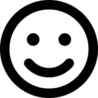

```{r}
#| label: DoNotModify
#| include: false
### Utilities. Do not modify.
# Installation of packages if necessary
InstallPackages <- function(Packages) {
  InstallPackage <- function(Package) {
    if (!Package %in% installed.packages()[, 1]) {
      install.packages(Package, repos = "https://cran.rstudio.com/")
    }
  }
  invisible(sapply(Packages, InstallPackage))
}

# Basic packages
InstallPackages(c("bookdown", "formatR", "kableExtra", "ragg"))

# kableExtra must be loaded 
if (knitr::opts_knit$get("rmarkdown.pandoc.to") == "docx") {
  # Word output (https://stackoverflow.com/questions/35144130/in-knitr-how-can-i-test-for-if-the-output-will-be-pdf-or-word)
  # Do not use autoformat (https://github.com/haozhu233/kableExtra/issues/308)
  options(kableExtra.auto_format = FALSE)
}
library("kableExtra")

# Chunk font size hook: allows size='small' or any valid Latex font size in chunk options
def.chunk.hook  <- knitr::knit_hooks$get("chunk")
knitr::knit_hooks$set(chunk = function(x, options) {
  x <- def.chunk.hook(x, options)
  ifelse(options$size != "normalsize", paste0("\n \\", options$size,"\n\n", x, "\n\n \\normalsize"), x)
})
```

```{r}
#| label: Options
#| include: false
### Customized options for this document
# Add necessary packages here
Packages <- c(
  "tidyverse", 
  "GoFKernel",
  "questionr"
)
# Install them
InstallPackages(Packages)

# knitr options
knitr::opts_chunk$set(
  cache =   TRUE,     # Cache chunk results
  include = TRUE,     # Show/Hide chunks
  echo =    TRUE,     # Show/Hide code
  warning = FALSE,    # Show/Hide warnings
  message = FALSE,    # Show/Hide messages
  # Figure alignment and size
  fig.align = 'center', out.width = '80%',
  # Graphic devices (ragg_png is better than standard png)
  dev = c("ragg_png", "pdf"),
  # Code chunk format
  tidy = FALSE, tidy.opts = list(blank = FALSE, width.cutoff = 50),
  size = "scriptsize", knitr.graphics.auto_pdf = TRUE
)
options(width = 50)

# ggplot style
library("tidyverse")
theme_set(theme_bw())
theme_update(
  panel.background = element_rect(fill = "transparent", colour = NA),
  plot.background = element_rect(fill = "transparent", colour = NA)
)
knitr::opts_chunk$set(dev.args = list(bg = "transparent"))

# Tibbles: 5 lines, fit to slide width
options(tibble.print_min = 5, tibble.width = 50)

# Random seed
set.seed(973)
```


# Statistiques descriptives

## Données

[Enquête de vie 2003](https://www.insee.fr/fr/statistiques/2532244) de l'INSEE

```{r}
library("questionr")
data(hdv2003)
```

{ height=40px } Afficher les tableaux avec `View()` 

## Moyenne, écart-type, médiane

Statistiques sur l'âge des personnes interrogées

```{r}
mean(hdv2003$age)
sd(hdv2003$age)
var(hdv2003$age)
median(hdv2003$age)
```

## Histogramme

```{r}
hist(hdv2003$age)
```

## Densité de probabilité

```{r}
plot(density(hdv2003$age))
```

## Densité sans réflexion

La densité n'est pas bornée

```{r}
plot(density(hdv2003$freres.soeurs))
```

## Densité avec réflexion

Utiliser le package *GoFKernel*

```{r}
library("GoFKernel")
plot(
  density.reflected(hdv2003$freres.soeurs, lower = 0)
)
```

## Histogramme lissé

Histogramme des probabilités 

```{r}
#| out-width: 50%
hist(
  hdv2003$freres.soeurs, 
  prob = TRUE,
  main = "",
  xlab = "Nombre de frères et soeurs"
)
lines(
  density.reflected(hdv2003$freres.soeurs, lower = 0), 
  col = "red"
)
```

## Quantiles

```{r}
summary(hdv2003$age)
quantile(hdv2003$age, probs = c(0.025, 0.975))
```

## Boîte à moustaches

```{r}
boxplot(hdv2003$age ~ hdv2003$sexe)
```

## Comptages

Pour les variables discrètes.

```{r}
table(hdv2003$sexe)
```

# Lois de Probabilités


## Distributions classiques

Incontournables:

- loi uniforme
- loi de Bernoulli, loi binomiale
- loi de Poisson
- loi normale (gaussienne)


## Loi uniforme

Densité de probabilité:

```{r}
curve(dunif(x, min = 0, max = 1), from = 0, to = 1)
```

## Loi uniforme

Fonction cumulative :

```{r}
curve(punif(x, min = 0, max = 1), from = 0, to = 1)
```

## Loi uniforme

Fonction quantile:

```{r}
qunif(p = 0.95, min = 0, max = 2)
```

## Loi uniforme

Tirage:

```{r}
runif(n = 5)
```
Toutes les distributions de probabilité ont des fonctions `d`, `p`, `q` et `r`.


## Loi des grands nombres{.columns-2}

\begincols
  \begincol{.48\textwidth}


```{r}
#| out-width: 90%
hist(runif(100))
```

  \endcol
  \begincol{.48\textwidth}
  <p class="forceBreak"></p>

```{r}
#| out-width: 90%
hist(runif(100000))
```

  \endcol
\endcols

La distribution des tirages tend vers la loi quand le nombre de tirages augmente.

## Loi des grands nombres

La moyenne tend aussi vers l'espérance:

```{r}
tirages_n <- 10000
tirages <- runif(tirages_n)
plot(x = 1:tirages_n, y = cumsum(tirages) / 1:tirages_n, type = "l")
abline(h = 0.5, col = "red")
```

## Loi binomiale

Nombre de succès d'une épreuve répétée `size` fois avec la probabilité de succès `prob`.

```{r}
hist(rbinom(tirages_n, size = 100, prob = 0.2))
```

## Loi de Poisson

Loi binomiale dont la probabilité de succès tend vers 0 et le nombre d'épreuves vers $+\infty$.

Ex.: combien d'arbres se trouvent dans 1000 m² de forêt avec une densité de 500/ha?

```{r}
#| out.width: 50%
# 10000 tirages, espérance = 500 * 0.1 
plot(density(rpois(tirages_n, 50)))
abline(v = 50, lty = 2)
```

## Loi normale

Distribution de la moyenne de nombreuses variables aléatoires.

```{r}
#| out.width: 60%
# 10000 tirages, espérance = 500 * 0.1 
plot(density(rnorm(tirages_n, mean = 50, sd = sqrt(50))))
abline(v = 50, lty = 2)
```
A comparer avec la loi de Poisson


## Loi log-normale

Loi dont le logarithme est normal.

Distribution du produit de nombreuses variables aléatoires.

```{r}
#| out.width: 60%
plot(
  density.reflected(rlnorm(tirages_n, meanlog = 0, sdlog = 1), lower = 0), 
  log ="x"
)
abline(v = exp(1/2), lty = 2)  # Espérance
abline(v = exp(-1), lty = 3)   # Mode 
```


## Théorème de la limite centrale{.columns-2}

\begincols
  \begincol{.48\textwidth}

```{r}
#| out-width: 90%
hist(
  replicate(
    tirages_n, 
    mean(runif(n = 2))
  )
)
```

  \endcol
  \begincol{.48\textwidth}
  <p class="forceBreak"></p>

```{r}
#| out-width: 90%
hist(
  replicate(
    tirages_n, 
    mean(runif(n = 30))
  )
)
```

  \endcol
\endcols

La distribution de la moyenne de $n$ variables uniformes tend vers la loi normale.
Sa variance est celle de la loi uniforme ($1/12$) divisée par $n$.


## Intervalle de confiance

$\alpha$ est le seuil de risque, en général 5%.

$1 - \alpha$ est le seuil de confiance, en général 95%.

95% des **tirages** d'une loi normale sont situés à moins de 1.96 écarts-types ($\sigma$) de l'espérance.

```{r}
qnorm(0.975)
```

## Intervalle de confiance{.columns-2}

\begincols
  \begincol{.48\textwidth}

La **moyenne** de $n$ variables aléatoires tend vers une loi normale.

95% de ses réalisations sont situés à moins de $1,96 \sigma / \sqrt{n}$ de l'espérance.

Précisément 1,96 est le 97,5ème centile de la loi de Student avec un très grand nombre de degrés de liberté.

```{r}
alpha <- 0.05
qt(1 - alpha / 2, df = 1E6)
```


  \endcol
  \begincol{.48\textwidth}
  <p class="forceBreak"></p>

```{r}
#| out-width: 70%
n = 30
plot(density(
  replicate(
    tirages_n, 
    mean(runif(n))
  )
))
ci <- qt(1-alpha/2, df = n - 1) / 
  sqrt(12) / sqrt(n)
abline(v = 0.5 + c(ci, -ci), 
       col = "red", lty = 2)
```

  \endcol
\endcols


## Test contre une valeur

Combien de temps regarde-t-on la TV par jour ?

```{r}
(tv_mean <- mean(hdv2003$heures.tv, na.rm = TRUE))
```

$n$ mesures individuelles, loi inconnue. La moyenne tend vers une loi normale.

```{r}
n <- sum(!is.na(hdv2003$heures.tv))
tv_sd <- sd(hdv2003$heures.tv, na.rm = TRUE)
ci <- qt(1 - alpha / 2, df = n - 1) * tv_sd / sqrt(n)
paste("Intervalle de confiance:", tv_mean - ci, "-", tv_mean + ci)
```

On regarde la TV plus de 2 heures par jour (95% de confiance).


## Méthode de Monte-Carlo

Si la loi est inconnue mais l'algorithme de simulation disponible.

Exemple : carré d'une distribution normale.

```{r}
#| out-width: 50%
dist <- rnorm(tirages_n)^2
(dist_q <- quantile(dist, c(0.025, 0.975)))
plot(density(dist), main = "")
abline(v = dist_q, col = "red", lty = 2)
```

## Méthode de Monte-Carlo

... mais on connaît souvent les distributions.

Le carré d'une loi normale est une loi du $\chi^2$ à 1 degré de liberté, identique à une loi $\Gamma$ de forme $1/2$ et d'échelle $2$.

```{r}
qchisq(.075, df = 1)
qchisq(.975, df = 1)
qgamma(0.975, shape = 1/2, scale = 2)
```


$\to$ lire l'aide `?qchisq`, Wikipedia, Google...


<!-- Styles for HTML slides -->
<style>
  /* Allow long bibliography */
  .forceBreak { -webkit-column-break-after: always; break-after: column; }
  slides > slide { overflow: scroll; }
  slides > slide:not(.nobackground):after { content: ''; }

  /* First page logo size */
  .gdbar img {
    width: 200px !important;
    height: 55px !important;
    margin: 8px 8px;
  }
  .gdbar {
    width: 250px !important;
    height: 70px !important;
  }
  
  /* No logo on slides */
  slides > slide:not(.nobackground):before {
    display:none
  }
</style>
