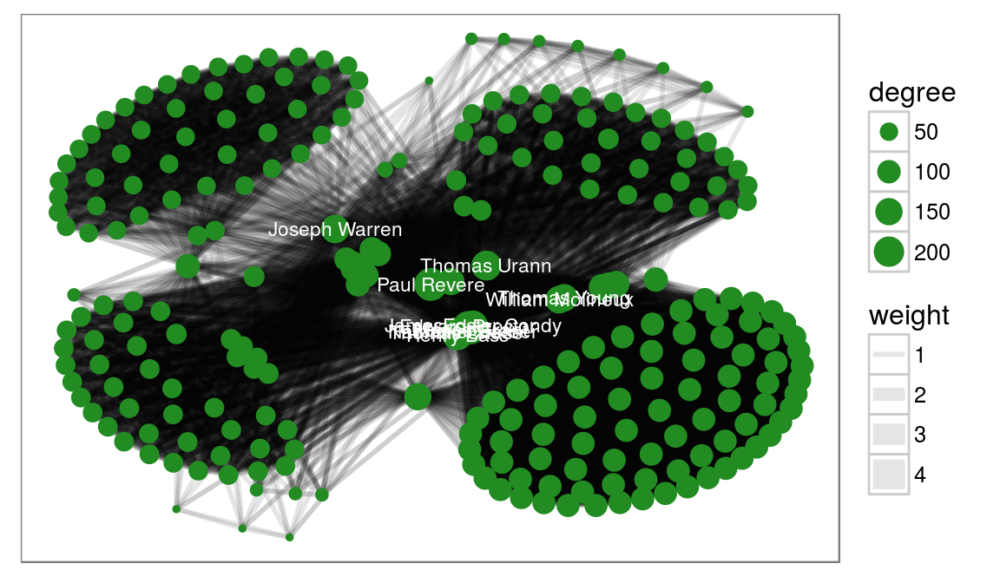

```{r}
#| label: DoNotModify
#| include: false
### Utilities. Do not modify.
# Installation of packages if necessary
InstallPackages <- function(Packages) {
  InstallPackage <- function(Package) {
    if (!Package %in% installed.packages()[, 1]) {
      install.packages(Package, repos = "https://cran.rstudio.com/")
    }
  }
  invisible(sapply(Packages, InstallPackage))
}

# Basic packages
InstallPackages(c("bookdown", "formatR", "kableExtra", "ragg"))

# kableExtra must be loaded 
if (knitr::opts_knit$get("rmarkdown.pandoc.to") == "docx") {
  # Word output (https://stackoverflow.com/questions/35144130/in-knitr-how-can-i-test-for-if-the-output-will-be-pdf-or-word)
  # Do not use autoformat (https://github.com/haozhu233/kableExtra/issues/308)
  options(kableExtra.auto_format = FALSE)
}
library("kableExtra")

# Chunk font size hook: allows size='small' or any valid Latex font size in chunk options
def.chunk.hook  <- knitr::knit_hooks$get("chunk")
knitr::knit_hooks$set(chunk = function(x, options) {
  x <- def.chunk.hook(x, options)
  ifelse(options$size != "normalsize", paste0("\n \\", options$size,"\n\n", x, "\n\n \\normalsize"), x)
})
```

```{r}
#| label: Options
#| include: false
### Customized options for this document
# Add necessary packages here
Packages <- c("tidyverse", "entropart")
# Install them
InstallPackages(Packages)

# knitr options
knitr::opts_chunk$set(
  cache =   TRUE,     # Cache chunk results
  include = TRUE,     # Show/Hide chunks
  echo =    TRUE,     # Show/Hide code
  warning = FALSE,    # Show/Hide warnings
  message = FALSE,    # Show/Hide messages
  # Figure alignment and size
  fig.align = 'center', out.width = '80%',
  # Graphic devices (ragg_png is better than standard png)
  dev = c("ragg_png", "pdf"),
  # Code chunk format
  tidy = FALSE, tidy.opts = list(blank = FALSE, width.cutoff = 50),
  size = "scriptsize", knitr.graphics.auto_pdf = TRUE
)
options(width = 50)

# ggplot style
library("tidyverse")
theme_set(theme_bw())
theme_update(
  panel.background = element_rect(fill = "transparent", colour = NA),
  plot.background = element_rect(fill = "transparent", colour = NA)
)
knitr::opts_chunk$set(dev.args = list(bg = "transparent"))

# Tibbles: 5 lines, fit to slide width
options(tibble.print_min = 5, tibble.width = 50)

# Random seed
set.seed(973)
```

# Visualisation

## _ggplot2_

Package destiné à la création de graphiques.

Respecte la [grammaire graphique par couches](http://vita.had.co.nz/papers/layered-grammar.pdf) :

```
ggplot(data = <DATA>) + 
  <GEOM_FUNCTION>(
     mapping = aes(<MAPPINGS>),
     stat = <STAT>, 
     position = <POSITION>
  ) +
  <COORDINATE_FUNCTION> +
  <FACET_FUNCTION>
```

Les données sont obligatoirement un dataframe (un tibble est un dataframe).


## Esthétique

L'esthétique  désigne ce qui est représenté : 

- `x` et `y` (ou `fill` pour un histogramme...) ;
- transparence, couleur, type de courbe, taille, ... : voir l'aide de chaque `geom_`.

Fonction `aes()` à plusieurs niveaux :

- argument `mapping` de `ggplot()`, hérité par les couches (`geom_`) ;
- argument `mapping` de chaque couche.


## Géométrie

La géométrie est définie par une fonction `geom_xxx` et une esthétique (ce qui est représenté).

```{r}
#| out.width: 70%
ggplot(data = diamonds) + 
  geom_point(mapping = aes(x = carat, y = price, color = cut)) + 
  scale_colour_brewer(palette = "Set1")
```

## Statistiques

Chaque `geom_` va de pair avec une statistique de transformation des données : 

- "identity" pour `geom_point` ;

- "boxplot" pour `geom_boxplot` ; 

- 20 statistiques disponibles...


## Statistiques

```{r}
ggplot(data=diamonds) + geom_boxplot(mapping = aes(x = cut, y = price))
```


## Statistiques

Différent de la transformation de variables (cf. _scale_) : le graphique utilise des données dérivées des données originales.

Chaque statistique a un `geom_` par défaut :

`stat_summary` est interchangeable avec `geom_pointrange`.


## Statistiques

```{r}
#| out.width: 70%
ggplot(data = diamonds) + 
  stat_summary(
    mapping = aes(x = cut, y = depth),
    fun = median,
    fun.min = min,
    fun.max = max
  )
```


## Echelle

Transformation de variable.

```{r, out.width='70%'}
diamonds |> filter(carat>.5) |> 
  ggplot(aes(x = carat, y=price)) + geom_point() + 
  scale_x_log10() + scale_y_log10() + geom_smooth(method="lm")
```


## Position

La position définit l'emplacement des objets sur le graphique.

- "identity" en général ;

- "stack" empile les catégories dans un histogramme ;

- "jitter" déplace aléatoirement les points dans un `geom_point` pour éviter les superpositions.


## Position

```{r, tidy=FALSE}
ggplot(data = diamonds) + 
  geom_bar(mapping = aes(x = cut, fill = color), position = "stack") + 
  scale_fill_brewer(palette = "Set1")
```


## Coordonnées

Système de coordonnées :

- `coord_flip()` intervertit `x` et `y` ;

- `coord_polar()` : coordonnées polaires ;

- `coord_trans()` transforme l'affichage des coordonnées (mais pas les données comme `scale_`) ;

- etc.

Exemple : tracer la carte des wapas de la parcelle 6 de Paracou.

## Coordonnées

```{r}
read_csv2("data/Paracou6.csv") |> 
  filter(Genus == "Eperua") |>
  ggplot() + 
  geom_point(
    aes(
      x = Xfield, 
      y = Yfield, 
      size = CircCorr, 
      color = Species
    )
  ) + 
  coord_fixed() +
  labs(x = NULL, y = NULL, size = "Circumference") -> 
  paracou6_wapas_map
```

## Coordonnées

```{r}
paracou6_wapas_map
```


## Facettes

Présente plusieurs aspects du même graphique.

```{r}
paracou6_wapas_map + facet_wrap(~ Species)
```

Remarquer : la possibilité d'affiner un graphique.


## Thèmes

Les thèmes définissent l'aspect des graphiques (hors traitement des données).

Dans ce document : pas de fond grisé dans les graphiques (`theme_bw`), police 12, modifié pour que le fond soit transparent.

```{r, eval=FALSE}
theme_set(theme_bw(base_size=12))
theme_update(
  panel.background = element_rect(fill = "transparent", colour = NA),
  plot.background = element_rect(fill = "transparent", colour = NA)
)
```

Ce sont des options globales, valides pour la session R en cours.


## Styles

Possibilité d'enregistrer des paramètres de forme au-delà du thème dans une liste.

Préparation d'un style pour l'impression en noir et blanc, sans cartouches de légende.

```{r, out.width='60%'}
style_nb <- list(scale_colour_grey(), theme(legend.position = "none"))
paracou6_wapas_map + style_nb
```

## Gestion des couleurs

Les couleurs par défaut sont assez laides.

Utiliser `scale_color_xxx` et `scale_fill_xxx`

Le suffixe `_brewer` est pour utiliser des palettes de [ColorBrewer](http://colorbrewer2.org)

```{r, echo=FALSE, out.width='60%'}
knitr::include_graphics("images/brewer.all.jpg")
```

## Gestion des couleurs

Le suffixe `_gradient` permet de produire un gradient de couleurs pour les valeurs continues.

Voir les autres fonctions dans l'aide du package.

- Méthode : se créer progressivement des styles (par ex. : couleur et noir et blanc), les enregistrer et les utiliser systématiquement.


## autoplot et qplot

`qplot()` mime la syntaxe de `plot()` avec _ggplot2_. 
Utiliser plutôt la syntaxe native.

`autoplot()` est un générique à étendre par des méthodes S3 pour faire des graphiques ggplot. 
Exemple:

```{r, out.width='50%', tidy=FALSE}
library("entropart")
rCommunity(1, size = 5000) |> 
  autoplot(Distribution = "lnorm") + style_nb
```

## Anti-sèche et extensions

[Anti-sèche](https://thinkr.fr/pdf/ggplot2-french-cheatsheet.pdf)

De nombreux packages étendent _ggplot2_ avec de nouveaux `geom_`. Exemple de _ggraph_ :

```{r, echo=FALSE, out.width='80%'}

```


<!-- Styles for HTML slides -->
<style>
  /* Allow long bibliography */
  .forceBreak { -webkit-column-break-after: always; break-after: column; }
  slides > slide { overflow: scroll; }
  slides > slide:not(.nobackground):after { content: ''; }

  /* First page logo size */
  .gdbar img {
    width: 200px !important;
    height: 55px !important;
    margin: 8px 8px;
  }
  .gdbar {
    width: 250px !important;
    height: 70px !important;
  }
  
  /* No logo on slides */
  slides > slide:not(.nobackground):before {
    display:none
  }
</style>
